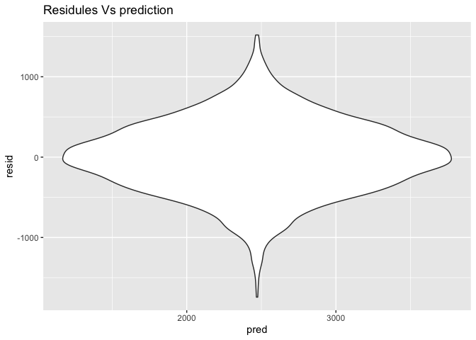
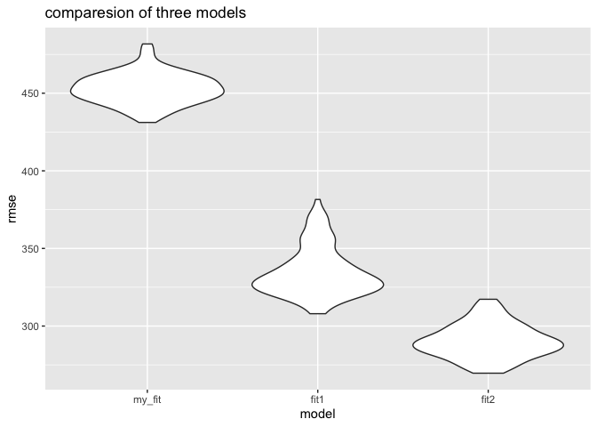
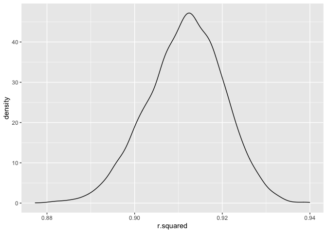
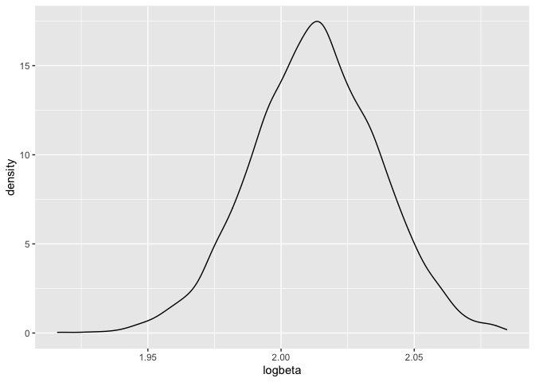

p8105\_hw6\_kh3074
================
KaiYu He(kh3074)
11/29/2021

# Loading packages

``` r
library(tidyverse)
```

    ## ── Attaching packages ─────────────────────────────────────── tidyverse 1.3.1 ──

    ## ✓ ggplot2 3.3.5     ✓ purrr   0.3.4
    ## ✓ tibble  3.1.2     ✓ dplyr   1.0.7
    ## ✓ tidyr   1.1.3     ✓ stringr 1.4.0
    ## ✓ readr   2.0.1     ✓ forcats 0.5.1

    ## ── Conflicts ────────────────────────────────────────── tidyverse_conflicts() ──
    ## x dplyr::filter() masks stats::filter()
    ## x dplyr::lag()    masks stats::lag()

``` r
library(modelr)
```

# Problem 1

### Data Cleaning

``` r
baby_df = read_csv("data/birthweight.csv")
```

    ## Rows: 4342 Columns: 20

    ## ── Column specification ────────────────────────────────────────────────────────
    ## Delimiter: ","
    ## dbl (20): babysex, bhead, blength, bwt, delwt, fincome, frace, gaweeks, malf...

    ## 
    ## ℹ Use `spec()` to retrieve the full column specification for this data.
    ## ℹ Specify the column types or set `show_col_types = FALSE` to quiet this message.

``` r
# Firstly check missing values.
colnames(baby_df)[colSums(is.na(baby_df)) > 0]
```

    ## character(0)

``` r
# There are no missing values in the dataframe

# Secondly change the class variables into factor
baby_df = 
  baby_df%>%
  mutate(babysex = as.factor(case_when(
    babysex == 2 ~ "female",
    babysex == 1 ~ "male"
  )))%>% 
  mutate(frace = as.factor(case_when(
    frace == 1 ~ "White",
    frace == 2 ~ "Black",
    frace == 3 ~ "Asian",
    frace == 4 ~ "Puerto Rican",
    frace == 8 ~ "Other"
  )))%>%
  mutate(mrace = as.factor(case_when(
    mrace == 1 ~ "White",
    mrace == 2 ~ "Black",
    mrace == 3 ~ "Asian",
    mrace == 4 ~ "Puerto Rican",
    mrace == 8 ~ "Other"
  )))%>%
  mutate (malform = as.factor(case_when(
    malform == 0 ~ "absent",
    malform == 1 ~ "present"
  )))
baby_df
```

    ## # A tibble: 4,342 x 20
    ##    babysex bhead blength   bwt delwt fincome frace gaweeks malform menarche
    ##    <fct>   <dbl>   <dbl> <dbl> <dbl>   <dbl> <fct>   <dbl> <fct>      <dbl>
    ##  1 female     34      51  3629   177      35 White    39.9 absent        13
    ##  2 male       34      48  3062   156      65 Black    25.9 absent        14
    ##  3 female     36      50  3345   148      85 White    39.9 absent        12
    ##  4 male       34      52  3062   157      55 White    40   absent        14
    ##  5 female     34      52  3374   156       5 White    41.6 absent        13
    ##  6 male       33      52  3374   129      55 White    40.7 absent        12
    ##  7 female     33      46  2523   126      96 Black    40.3 absent        14
    ##  8 female     33      49  2778   140       5 White    37.4 absent        12
    ##  9 male       36      52  3515   146      85 White    40.3 absent        11
    ## 10 male       33      50  3459   169      75 Black    40.7 absent        12
    ## # … with 4,332 more rows, and 10 more variables: mheight <dbl>, momage <dbl>,
    ## #   mrace <fct>, parity <dbl>, pnumlbw <dbl>, pnumsga <dbl>, ppbmi <dbl>,
    ## #   ppwt <dbl>, smoken <dbl>, wtgain <dbl>

``` r
baby_df%>%
  head(5)%>%
  knitr::kable()
```

| babysex | bhead | blength |  bwt | delwt | fincome | frace | gaweeks | malform | menarche | mheight | momage | mrace | parity | pnumlbw | pnumsga |    ppbmi | ppwt | smoken | wtgain |
|:--------|------:|--------:|-----:|------:|--------:|:------|--------:|:--------|---------:|--------:|-------:|:------|-------:|--------:|--------:|---------:|-----:|-------:|-------:|
| female  |    34 |      51 | 3629 |   177 |      35 | White |    39.9 | absent  |       13 |      63 |     36 | White |      3 |       0 |       0 | 26.27184 |  148 |      0 |     29 |
| male    |    34 |      48 | 3062 |   156 |      65 | Black |    25.9 | absent  |       14 |      65 |     25 | Black |      0 |       0 |       0 | 21.34485 |  128 |      0 |     28 |
| female  |    36 |      50 | 3345 |   148 |      85 | White |    39.9 | absent  |       12 |      64 |     29 | White |      0 |       0 |       0 | 23.56517 |  137 |      1 |     11 |
| male    |    34 |      52 | 3062 |   157 |      55 | White |    40.0 | absent  |       14 |      64 |     18 | White |      0 |       0 |       0 | 21.84508 |  127 |     10 |     30 |
| female  |    34 |      52 | 3374 |   156 |       5 | White |    41.6 | absent  |       13 |      66 |     20 | White |      0 |       0 |       0 | 21.02642 |  130 |      1 |     26 |

-   In the Data Cleaning I checked for the missing value and mutate all
    the class variable form double into factors.

### Propose a regression model for birthweight.

``` r
#I think gestational and mother’s weight gain during pregnancy (pounds) are the key factors of babies' weight
my_fit = lm(bwt ~ gaweeks*wtgain ,data = baby_df)
my_fit %>%
  broom::tidy() %>%
  select(term, estimate, p.value) %>%
  knitr::kable(digits = 4)
```

| term           |  estimate | p.value |
|:---------------|----------:|--------:|
| (Intercept)    | -846.6791 |       0 |
| gaweeks        |   95.5577 |       0 |
| wtgain         |   71.8843 |       0 |
| gaweeks:wtgain |   -1.5915 |       0 |

``` r
#plot the residuals against the fitted values
baby_df%>%
  add_predictions(my_fit)%>%
  add_residuals(my_fit)%>%
  ggplot(aes(x = pred ,y = resid))+
  geom_violin()+
  labs(title = "Residules Vs prediction")
```

<!-- --> - I
firstly draw plots about factors i’m interested in against the to see

-   Comparison in terms of the cross-validated prediction error

``` r
baby_cv_df = 
  crossv_mc(baby_df,100)%>%
  mutate(
    my_fit = map(train, ~lm(bwt ~ gaweeks*wtgain, data = .x)),
    fit1   = map(train, ~lm(bwt ~ blength + gaweeks, data = .x)),
    fit2   = map(train, ~lm(bwt ~ bhead * blength * babysex, data = as_tibble(.x)))) %>% 
  mutate(
    rmse_my_fit = map2_dbl(my_fit, test, ~rmse(model = .x, data = .y)),
    rmse_fit1   = map2_dbl(fit1, test, ~rmse(model = .x, data = .y)),
    rmse_fit2   = map2_dbl(fit2, test, ~rmse(model = .x, data = .y)))

#Now Drawing plots to compare
baby_cv_df %>% 
  select(starts_with("rmse")) %>% 
  pivot_longer(
    everything(),
    names_to = "model", 
    values_to = "rmse",
    names_prefix = "rmse_") %>% 
  mutate(model = fct_inorder(model)) %>% 
  ggplot(aes(x = model, y = rmse)) + geom_violin()+
  labs(title="comparesion of three models")
```

<!-- --> -
Apparently my modle doesn’t goes well, the best model is the third one
with head circumference, length, sex, and all interactions.

# Problem 2

### Load Data

``` r
weather_df = 
  rnoaa::meteo_pull_monitors(
    c("USW00094728"),
    var = c("PRCP", "TMIN", "TMAX"), 
    date_min = "2017-01-01",
    date_max = "2017-12-31") %>%
  mutate(
    name = recode(id, USW00094728 = "CentralPark_NY"),
    tmin = tmin / 10,
    tmax = tmax / 10) %>%
  select(name, id, everything())
```

    ## Registered S3 method overwritten by 'hoardr':
    ##   method           from
    ##   print.cache_info httr

    ## using cached file: ~/Library/Caches/R/noaa_ghcnd/USW00094728.dly

    ## date created (size, mb): 2021-10-05 09:45:01 (7.602)

    ## file min/max dates: 1869-01-01 / 2021-10-31

### boostrapping

-   Checking rsquare

``` r
# r.squared
set.seed(1234)
r_squared_df = 
  weather_df %>%
  bootstrap(n = 5000) %>% 
  mutate(models = map(strap,~lm(tmax ~ tmin,data = .x)),
         results = map(models,broom::tidy),
         r2 = map(models,broom::glance))%>%
  select(-strap,-models)%>%
  unnest(r2)

r_squared_df
```

    ## # A tibble: 5,000 x 14
    ##    .id   results  r.squared adj.r.squared sigma statistic   p.value    df logLik
    ##    <chr> <list>       <dbl>         <dbl> <dbl>     <dbl>     <dbl> <dbl>  <dbl>
    ##  1 0001  <tibble…     0.895         0.895  3.11     3099. 7.45e-180     1  -932.
    ##  2 0002  <tibble…     0.901         0.901  3.05     3304. 2.23e-184     1  -924.
    ##  3 0003  <tibble…     0.906         0.906  2.88     3516. 8.30e-189     1  -903.
    ##  4 0004  <tibble…     0.923         0.922  2.74     4334. 6.78e-204     1  -885.
    ##  5 0005  <tibble…     0.894         0.894  3.04     3073. 2.93e-179     1  -923.
    ##  6 0006  <tibble…     0.924         0.924  2.86     4404. 4.61e-205     1  -901.
    ##  7 0007  <tibble…     0.914         0.914  2.90     3875. 8.66e-196     1  -905.
    ##  8 0008  <tibble…     0.913         0.913  2.86     3828. 6.42e-195     1  -901.
    ##  9 0009  <tibble…     0.935         0.935  2.57     5235. 9.78e-218     1  -861.
    ## 10 0010  <tibble…     0.921         0.920  2.82     4208. 9.26e-202     1  -896.
    ## # … with 4,990 more rows, and 5 more variables: AIC <dbl>, BIC <dbl>,
    ## #   deviance <dbl>, df.residual <int>, nobs <int>

``` r
r_squared_df%>%
  ggplot(aes(x = r.squared))+
  geom_density()
```

<!-- --> -
The distribution of r.squared is a bell shaped distribution with mean:
0.9115435, and the standard deviation 0.0087012, the 95% CI is
\[0.893665,0.9276334\]

-   Checking logbeta

``` r
set.seed(1234)
logbeta_df = 
  weather_df %>%
  bootstrap(n = 5000) %>% 
  mutate(models = map(strap,~lm(tmax ~ tmin,data = .x)),
         results = map(models,broom::tidy))%>%
  select(-strap,-models)%>%
  unnest(results)%>%
  select(.id,term,estimate)%>%
  pivot_wider(names_from = term,values_from = estimate)%>%
  janitor::clean_names()%>%
  mutate(logbeta = log(intercept*tmin))

# Draw distribution of log(beta0 * beta1)
logbeta_df %>%
  ggplot(aes(x = logbeta))+
  geom_density()
```

<!-- -->

-   The distribution of *l**o**g*(*β*<sub>0</sub> \* *β*<sub>1</sub>) is
    a bell shaped distribution with mean: 2.0126402, and the standard
    deviation 0.0238596, the 95% CI is \[1.9650804,2.0589998\]
